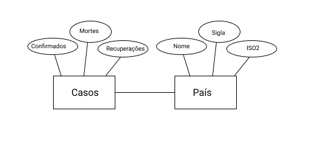

# Modelo para Apresentação do Lab01 - API Acesso

Estrutura de pastas:

~~~
├── README.md  <- arquivo apresentando a tarefa
│
├── images     <- arquivo de imagem da tarefa
│
└── notebook   <- arquivos do notebook
~~~

# Aluno
* 206457: Victor Agozzini Scholze

## Tarefa 1 sobre APIs de acesso

> [Notebook](notebook/lab01-api.ipynb)

## Tarefa 2 sobre Engenharia Reversa
> Diagrama sobre a primeira API utilizada
> 
