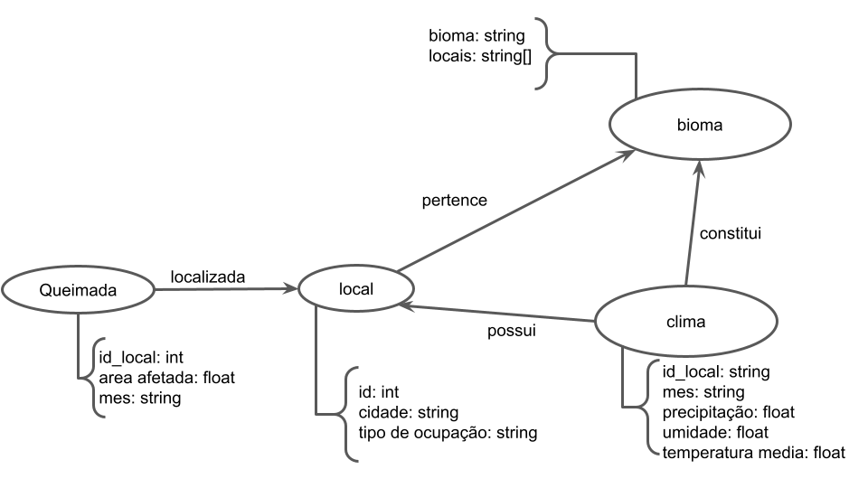

# Apresentação do Lab07 - Modelo Lógico para Banco de Dados de Grafos

Estrutura de pastas:

~~~
├── README.md  <- arquivo apresentando a tarefa
│
└── images     <- arquivos de imagem usados na tarefa
~~~

# Aluno
* `206457`: `Victor Agozzini Scholze`

## Modelo Lógico do Banco de Dados de Grafos
> 

## Perguntas de Pesquisa/análise

> * Onde estão localizadas a maioria das queimadas?
> * Quais foram as queimadas em determinado bioma?
> * Qual o clima predominante dos locais de queimadas?
> * Quais queimadas ocorreram em local com muita precipitação?
> * Qual o tipo de ocupação no local da queimada?
> * Qual bioma possui menos queimadas?
