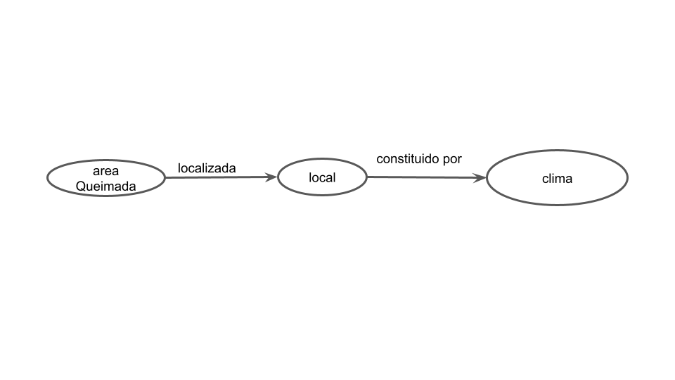
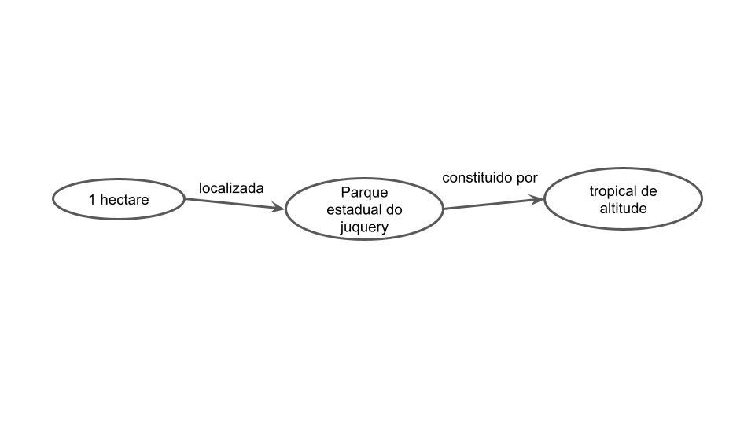

# Apresentação do Lab09 - Grafo de Conhecimento

Estrutura de pastas:

~~~
├── README.md  <- arquivo apresentando a tarefa
│
└── images     <- arquivos de imagem usados na tarefa
~~~

# Aluno
* `206457`: `Victor Agozzini Scholze`

## Grafo de Conhecimento - para publicar ou enriquecer

> Grafo ilustrando as classes:
> 
>
> Grafo ilustrando a instância:
> 

## Perguntas de Pesquisa ou Queries

> Liste aqui as três perguntas de pesquisa ou queries
> * Qual o clima onde ocorreu a queimada?
> * Onde foi a queimada?
> * Qual a área queimada?
